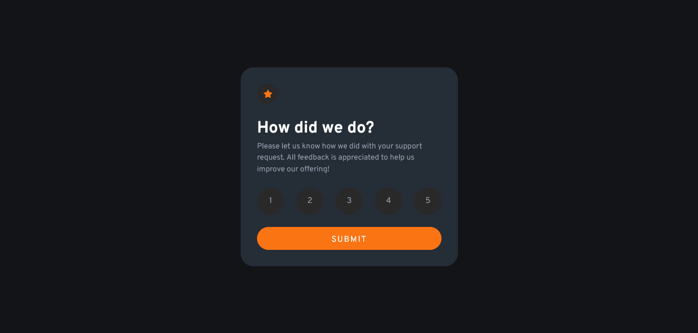

# Frontend Mentor - Interactive rating component solution

This is a solution to the [Interactive rating component challenge on Frontend Mentor](https://www.frontendmentor.io/challenges/interactive-rating-component-koxpeBUmI).

### **[Hosted with Netlify]() (Click to see in-browser solution)**

---

## Table of contents

- [Overview](#overview)
  - [The challenge](#the-challenge)
  - [Screenshot](#screenshot)
- [My process](#my-process)
  - [Built with](#built-with)
  - [Useful resources](#useful-resources)
- [Author](#author)

## Overview

### The challenge

Users should be able to:

- View the optimal layout for the app depending on their device's screen size
- See hover states for all interactive elements on the page
- Select and submit a number rating
- See the "Thank you" card state after submitting a rating

---

### Screenshot

## My process

### Built with

- HTML5
- CSS custom properties
- CSS Grid
- JavaScript
- [React](https://reactjs.org/) - JS library
- create-react-app
- [Framer Motion](https://www.framer.com/motion/) - JS library for animating in React

If you want more help with writing markdown, we'd recommend checking out [The Markdown Guide](https://www.markdownguide.org/) to learn more.

---

### Useful resources

- [Codecademy](https://www.codecademy.com) - Introductory courses on HTML, CSS, JavaSript and React
- [Kevin Powell](https://www.example.com) - Major help with CSS styling

---

## Author

- Website - [Add your name here](https://www.your-site.com)
- Frontend Mentor - [@joshbraham](https://www.frontendmentor.io/profile/joshbraham)
